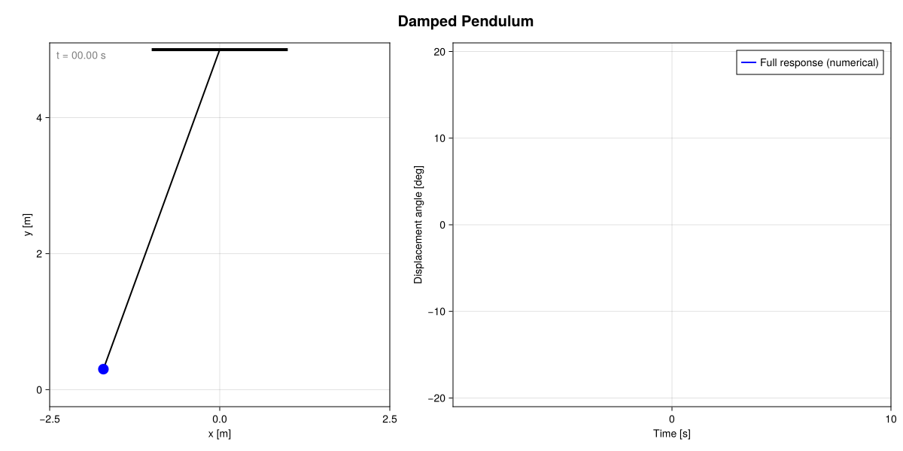
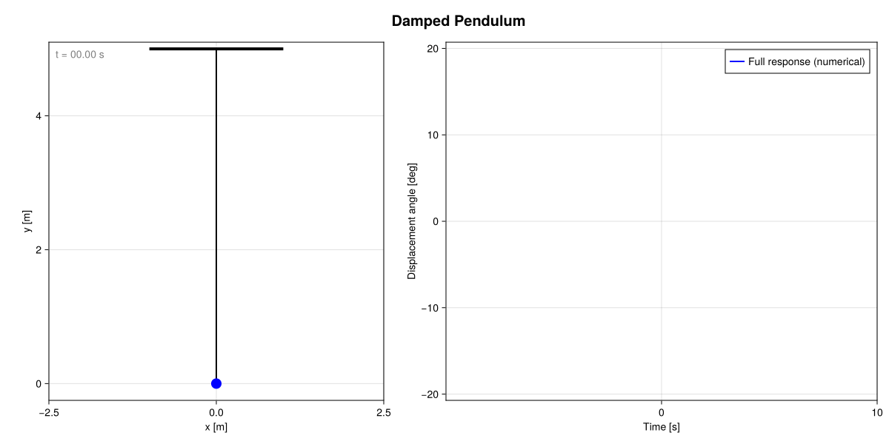
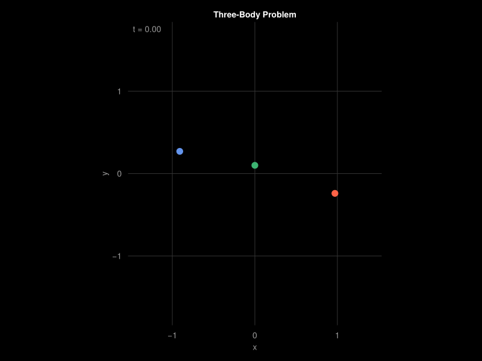
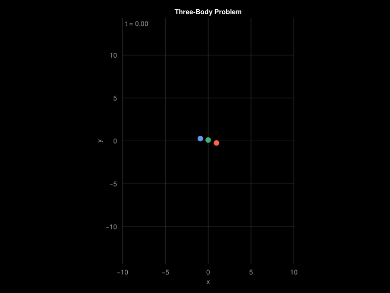

```@meta
CurrentModule = Springies
CollapsedDocStrings = true
```

# Example Gallery

This page contains demos of simulations which can be run with `Springies.jl`. The code used to produce these is available in the `runs` folder in the repo.

## Unforced pendulums

We can launch a pendulum by dropping it from rest:



We can instead launch it with a nonzero initial velocity:



## Forced pendulums

We can make a crude simulation of a clock pendulum by forcing the pendulum when it is moving outwards:


If we apply a periodic forcing to the pendulum, it eventually reaches a steady state controlled by that forcing. This steady state can be found through nondimensionalisation:


## The Double Gyre

We can use `Springies.jl` to play with advection in the canonical [Double Gyre](https://shaddenlab.berkeley.edu/uploads/LCS-tutorial/overview.html) problem:


What if, instead of a velocity field, we were to think of the Double Gyre as a wind force blowing over a field of grass? Let's model the grass blades as flexible beams; we'll decouple the x and y components and think of two springs, one in the x and the other in the y direction:


## The Three-body problem

Here is an example of the three-body problem in 2D:



If we run the simulation for longer, we can see the formation of a bound pair and the ejection of the third body: 

